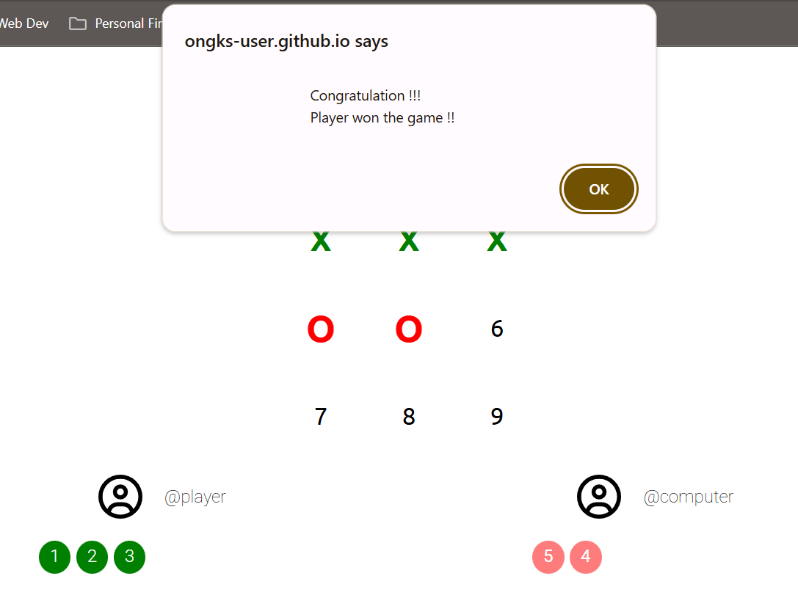

# The Odin Project: [Tic Tac Toe](https://www.theodinproject.com/lessons/node-path-javascript-tic-tac-toe)  

Objective:  
--> Learn about the flaw of JavaScript object constructor  
--> Learn about JavaScript `Factory Functions` & `Module Pattern`  
--> Apply Factory Function & Module Pattern to build Tic Tac Toe game. User is the `Player` and play against `Computer`.  

Guideline:  
1. Click on the `Play` button on top of the page to start the game.
2. Windows will prompt `Player` / `Computer` to pick a number.  
3. When any 3 numbers selected by `Player` or `Computer` match the combinations (example: `1, 2, 3` / `4, 5, 6`),   
the game will announce the winner and stop the game.

Click [here](https://ongks-user.github.io/tic-tac-toe/) for Tic Tac Toe game hosted on Github page.